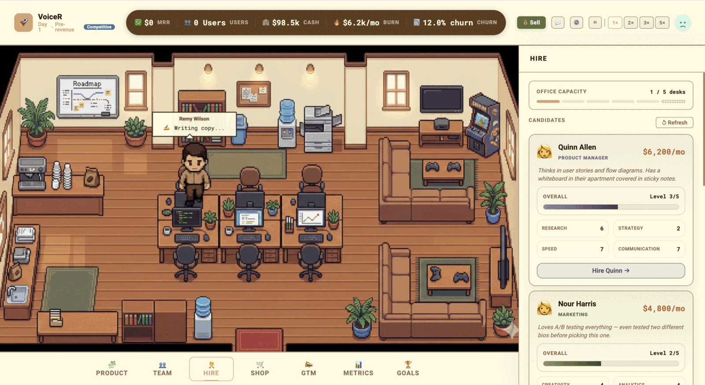
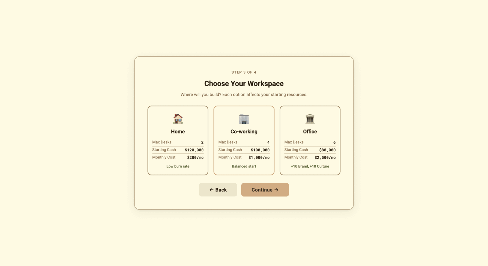
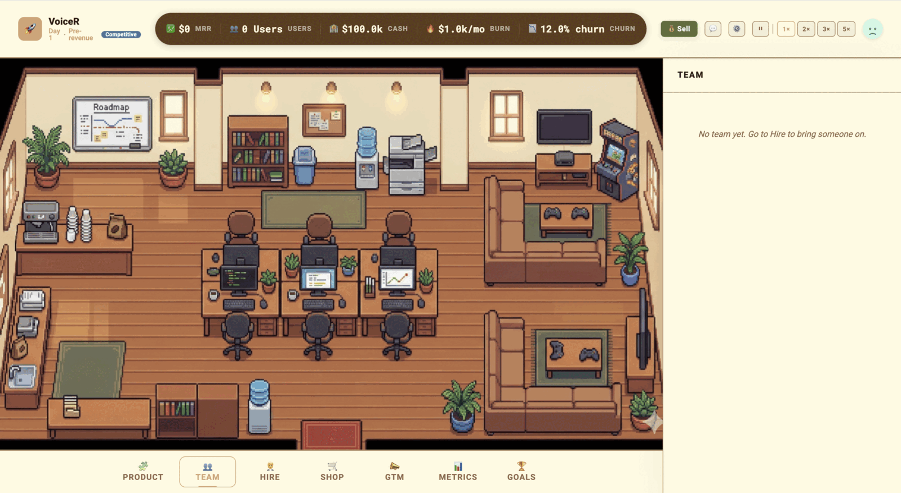
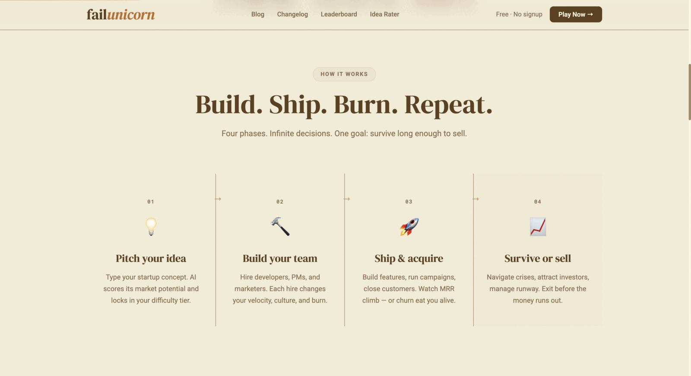
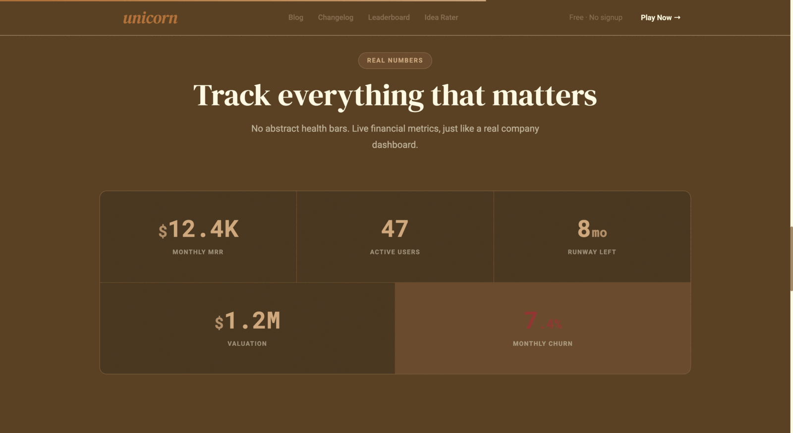

<div align="center">

# failunicorn

**A startup simulator where you probably die.**

Hire a team, ship features, burn runway, survive crises. Get to $10k MRR before the cash hits zero — most players don't.

[Play it](https://failunicorn.vercel.app) · [Blog](https://failunicorn.vercel.app/blog) · [Leaderboard](https://failunicorn.vercel.app/leaderboard) · [Idea Rater](https://failunicorn.vercel.app/tools/startup-idea-rater)

[](https://github.com/LaKhWaN/startup-game/actions/workflows/ci.yml)
[](LICENSE)

<br />



</div>

---

## What it is

A browser game. You describe a startup idea, an AI scores it, and that score sets your difficulty. Then you play: 1 real second is 1 game hour. Features take days to build. Campaigns pay off or flop. Churn eats your customers. Salaries hit every 30 days whether or not you can afford them.

- **Win:** $10k MRR (200 customers at $50 ARPU)
- **Lose:** cash reaches $0

No signup, no backend account, saves live in your browser.

## Screenshots

<table>
  <tr>
    <td width="50%">
      
      <p align="center"><em>Every choice is a trade-off. Home gives you $120k and 2 desks; an Office gives you 6 desks, brand and culture — and $40k less runway.</em></p>
    </td>
    <td width="50%">
      
      <p align="center"><em>Day 1. No team, $100k in the bank, and 12% churn already working against you.</em></p>
    </td>
  </tr>
  <tr>
    <td width="50%">
      
      <p align="center"><em>Four phases, from pitching an idea to selling — or running out of money.</em></p>
    </td>
    <td width="50%">
      
      <p align="center"><em>No abstract health bars. MRR, runway, churn and valuation, like a real dashboard.</em></p>
    </td>
  </tr>
</table>

## Quick start

Requires **Node 20+** (developed on 24).

```bash
git clone https://github.com/LaKhWaN/startup-game.git
cd startup-game
npm install
cp .env.example .env    # optional — see below
npm run dev
```

Open the URL Vite prints. **It runs with an empty `.env`** — idea scoring falls back to a local heuristic and analytics are skipped. You only need keys for those specific features:

| Variable | Needed for | Without it |
|---|---|---|
| `GEMINI_API_KEY` | AI idea scoring, via `/api/rate-idea` | Falls back to a keyword heuristic |
| `MONGODB_URI` | Analytics + global leaderboard | Those routes return 503 |
| `MONGODB_DB_NAME` | — | Defaults to `startup-game` |
| `VITE_SITE_URL` | Canonical URLs, OG tags, sitemap, share links | Defaults to `https://failunicorn.vercel.app` |
| `VITE_DISABLE_REMOTE_ANALYTICS` | — | Set `true` to never phone home |

> `VITE_`-prefixed variables are **inlined into the client bundle and publicly readable**. Never put a secret behind one — that's why the Gemini key has no prefix and is only ever read server-side. See [SECURITY.md](SECURITY.md).

## Scripts

```bash
npm run dev        # dev server with the /api routes wired up
npm run build      # generate sitemap → typecheck → production build
npm run preview    # serve the production build
npm run mongo:ping # check your MONGODB_URI connects
```

## How it's put together

**Vite + React + TypeScript + Zustand + Phaser 3**, deployed on Vercel.

```
src/
  App.tsx            game shell — routes on phase: setup → playing → sold/lost
  router.tsx         react-router routes, all lazy-loaded
  store/gameStore.ts Zustand store: GameState + actions
  engine/            all game logic (tick, campaigns, events, features, churn)
  office/            Phaser scene for the office view
  components/        UI — TopBar, BottomNav, panels, modals, toasts
  pages/             marketing pages: blog, changelog, leaderboard, idea rater
  data/              blog post and changelog content
  analytics/         client → /api ingest
server/              MongoDB handlers (dev, via the Vite middleware)
api/                 the same handlers as Vercel serverless functions
vite/plugins/        dev middleware routing /api/* to server/
```

**The game loop.** `processDayTick` runs every 24 game hours — features build, campaigns run, churn applies. `processMonthTick` runs every 30 days — salaries out, MRR recalculated, events roll.

**Analytics are three layers:** a handler in `server/` that takes raw JSON and returns `{status, body}`, a route in `vite/plugins/analyticsApi.ts` for dev, and a fetch wrapper in `src/analytics/`. Vercel gets its own copy in `api/`. If you touch one, check the other — they have drifted before.

More design notes live in [`MVP.md`](MVP.md) and [`docs/`](docs/).

## Contributing

Contributions welcome — see **[CONTRIBUTING.md](CONTRIBUTING.md)** for setup, conventions, and what makes a good PR. Good places to start are the issues labelled [`good first issue`](https://github.com/LaKhWaN/startup-game/labels/good%20first%20issue).

Balance changes (prices, churn rates, event odds) are genuinely useful and need no deep knowledge of the codebase — the numbers are all in `src/engine/`.

By contributing you agree your work is licensed under the MIT License.

## License

[MIT](LICENSE) © Upender Singh Lakhwan
